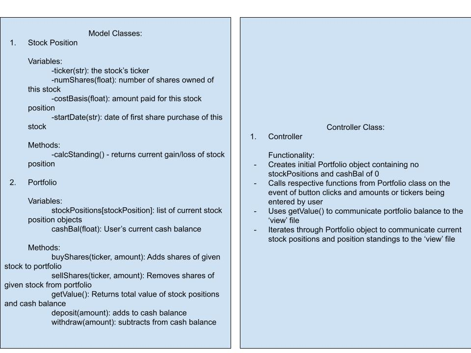

# CS110 Project Proposal
# Day trading simulator
## CS 110 Final Project
### Summer, 2021
### [Assignment Description](https://docs.google.com/document/d/1H4R6yLL7som1lglyXWZ04RvTp_RvRFCCBn6sqv-82ps/edit#)

https://github.com/bucs110sum21/final-project-pettabytes

<< [link to demo presentation slides](https://docs.google.com/presentation/d/12FjyYHfmlNT5dS9UIUZ8JjVOuhgNOM9Y_ivXMrfrtGQ/) >>

### Team: Pettabytes
#### Ryan Levine, Dennis Shin, Eyal Hakimi

***

## Project Description *(Software Lead)*
Our goal is to create a simulation of the stock market in which the user has money that they can use to buy stocks using up to date stock prices.

***    

## User Interface Design *(Front End Specialist)*
<<<<<<< HEAD
* << A wireframe or drawing of the user interface concept along with a short description of the interface. You should have one for each screen in your program. >>
    * For example, if your program has a start screen, game screen, and game over screen, you should include a wireframe / screenshot / drawing of each one and a short description of the components
=======
* [Main screen](etc/project_screenshot.png)
* The program uses one screen with buttons to buy or sell stocks and to deposit or withdraw cash. The text input for each of these processes is done in the command line. Holdings appear in a column of boxes that can scroll up or down with corresponding arrows. 
>>>>>>> ac73db419a28a0ccd4054b152561aed825823e1a

***        

## Program Design *(Backend Specialist)*
* Non-Standard libraries
	-yahoo-finance
		-link: https://pypi.org/project/yahoo-finance/
		-description: This module provides several methods that can be used to pull ive stock data from Yahoo finance. The main method that will be used in this application is the 'get_live_price(ticker)' method which returns the current price of a given stock based on the string parameter provided.
	-pygame
		-link: https://pypi.orh/project/pygame/
		-description: This module provides the methods necessary for controlling this application's GUI.

* Class Interface Design
<<<<<<< HEAD
    * << A simple drawing that shows the class relationships in your code (see below for an example). >>
        * 
=======
    * 
>>>>>>> ac73db419a28a0ccd4054b152561aed825823e1a
    * This does not need to be overly detailed, but should show how your code fits into the Model/View/Controller paradigm.

* Classes
    -StockPosition - This class is meant to represent an individual stock position.
		-Instance Variables: It's first instance variable is 'ticker', which is a string variable that stores the ticker of the stock position. Next, the variable 'numShares' is a float that stores the number of shares of that specific stock that are owned by the user. Third, the float variable 'costBasis' keeps track of the total amount of cash spent to buy the shares for this position. Lastly, the string variable 'startDate' keeps track of the date when this position was initiated.
		-Methods: calcStanding() returns the current gain/loss of a current stockPosition

     -Portfolio - This class is meant to represent a portfolio of stock positions.
		-Instance Variables:
			-stockPositions[stockPosition] - a list composed stockPosition objects that correspond to those owned by the user.
			-cashBal- a float that keeps track of the user's cash balance
		-Methods:
			-buyShares(ticker, numShares) - Adds shares of a given stock to portfolio and subtracts cost from cashBal
			-sellShares(ticker, numShares) - Removes shares of a given stock and adds proceeds to cashBal
			-getValue(): Returns the total current value of the user's stock positions and cashBal
			-depositCash(amount): Adds given amount to cashBal
			-withdrawCash(amount): Subtracts given amount from cashBal

## Project Structure *(Software Lead)*

The Project is broken down into the following file structure:
* main.py
* src
    * Screens.py
    * button.py
    * controller.py
    * portfolio.py
    * stockPosition.py
    * foldercontents.txt
* assets
    * arrow.png
    * buyBut.png
    * depositBut.png
    * holdingBox.png
    * sellBut.png
    * withdrawBut.png
* etc
    * class_diagram.jpg
    * foldercontents.txt
    * project_screenshot.png
    * stockClassDiagram.png

***

## Tasks and Responsibilities *(Software Lead)*
* You must outline the team member roles and who was responsible for each class/method, both individual and collaborative.

### Software Lead - Dennis Shin

Double checked the code to make sure that everything was working as intended

### Front End Specialist - Eyal Hakimi

Worked on the GUI and different "screens of our application"

### Back End Specialist - Ryan Levine

Took care of adding in yahoo_finance module and functions using yahoo_finance. Responsible for all classes in portfolio.py and stockPosition.py

## Testing *(Software Lead)*
* User will buy and sell stocks and then deposit and withdraw money from account

* Your ATP

| Step                  | Procedure     | Expected Results  | Actual Results |
| ----------------------|:-------------:| -----------------:| -------------- |
|  1  | Run Day Trade Program  | GUI window appears with buy/sell buttons  |     Correct     |
|  2  | click buy button  | prompt shows in terminal for ticker |        Correct         |
|  3 | enter aapl (apple stocks)  | prompt shows in terminal for how many shares you wish to buy |      Correct           |
|  4  | enter 6  | aapl stock shows on GUI and shows how much money you have invensted and how many shares you have |       Correct          |
|  5  | click buy button  | prompt shows in terminal for ticker |       Correct          |
|  6  | enter msft (microsoft stocks)  | prompt shows in terminal for how many shares you wish to buy |      Correct           |
|  7  | enter 4  | msft stock shows on GUI and shows how much money you have invensted and how many shares you have |        Correct         |
|  8  | click sell button | prompt shows asking for ticker |       Correct          |
|  9  | enter aapl  | prompt shows asking for how many shares user wishes to sell |       Correct          |
|  10 | enter 4  | aapl GUI element updates to 2 shares from 6 |       Correct          |
|  11  | click deposit button  | prompt asks how much user wishes to deposit |       Correct          |
|  12  | enter 5000  | GUI elements for balance and cash update and add 5000 to total |       Correct          |
|  13  | click withdraw button  | prompt asks how much user wishes to withdraw |      Correct          |
|  14  | enter 10000  | GUI elements for balance and cash update and subtract 10000 to total |       Correct          |

